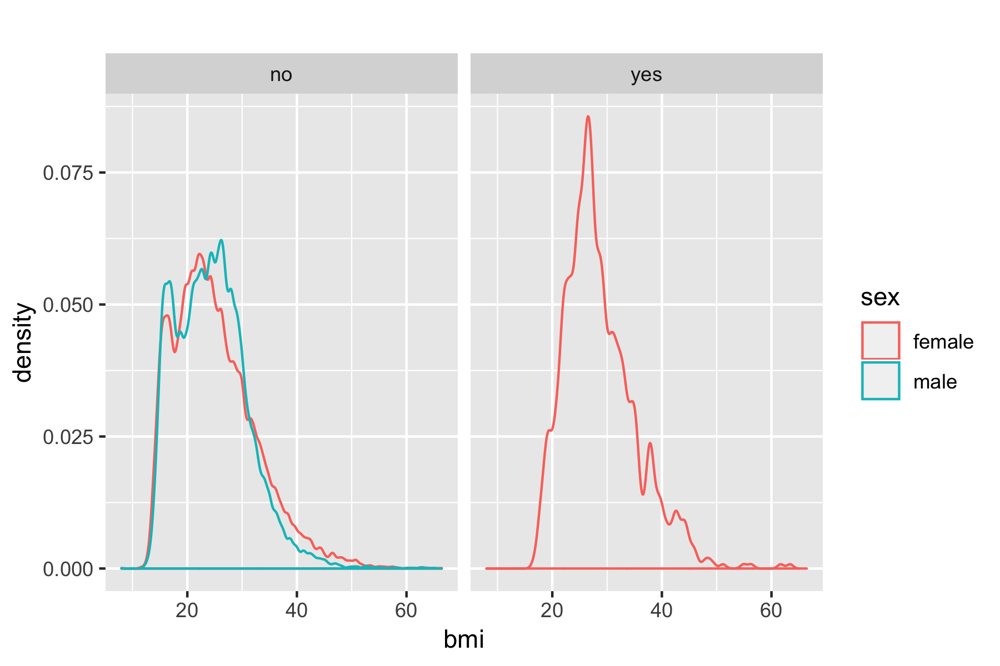
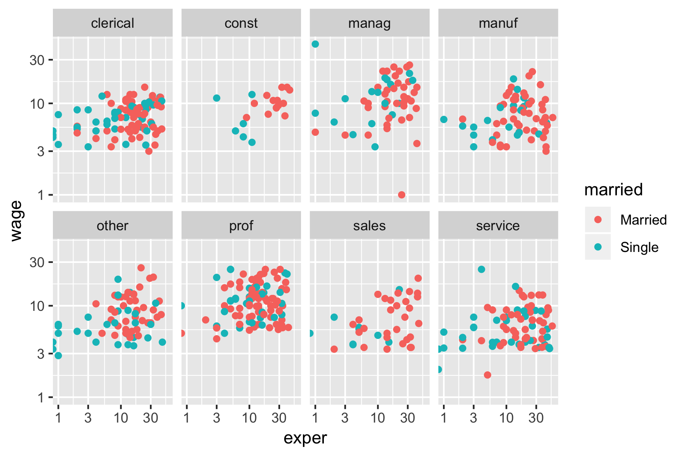

## Front Matter

Install supporting R packages with necessary functions and data sets.

```{r} 
# load packages
library(mosaic)     # includes `mplot()` function as well as both `NCHS` and `CPS85` data sets
library(tidyverse)  # loads a group of useful packages including `ggplot2`
```


###  Problem 5.3 (from DataComputing book)



Using the `NCHS` data table, produce the `ggplot2` code that reproduces the above graphic.  Note: The "yes" and "no" in the gray bars refer to whether or not the person is pregnant.  Show your R code and the plot it produces using the empty code chunk below.  


```{r}
# add your code here


```


###  Problem 5.4 (from DataComputing book)




Using the `CPS85` data table, produce the `ggplot2` code that reproduces the above graphic.  Show your R code and the plot it produces using the empty code chunk below.


```{r}
# add your code here


```


